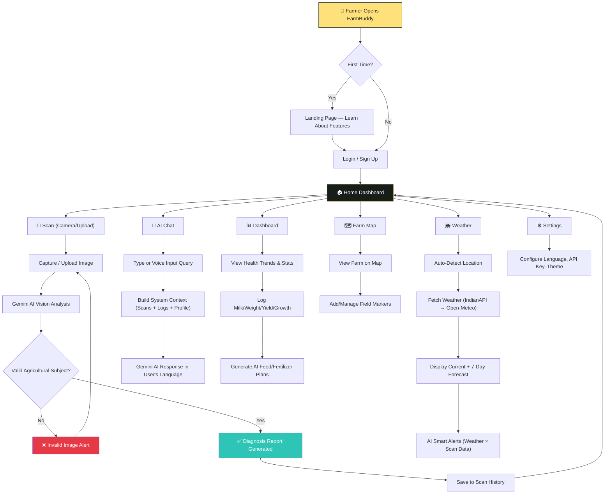
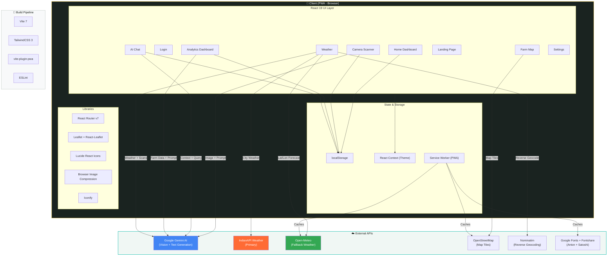

# 🌾 FarmBuddy — AI-Powered Smart Agriculture Diagnostic Platform

> **Tagline:** *Scan. Diagnose. Protect. — AI-powered farm diagnostics in 22 Indian languages.*

---

## 1. Brief About the Solution

**FarmBuddy** is a Progressive Web Application (PWA) that empowers Indian farmers with instant, AI-powered crop and livestock disease diagnostics using just their smartphone camera. By leveraging Google's **Gemini AI** vision models, FarmBuddy analyzes photos of crops and livestock in real-time, delivering detailed diagnoses, severity assessments, treatment plans, and preventive measures — all translated into **22 scheduled Indian languages**.

### The Problem

Indian agriculture suffers from:
- **₹50,000+ crore** annual crop losses due to delayed disease identification
- 70% of farmers lack access to professional agronomists or veterinarians
- Language barriers prevent adoption of existing English-only agri-tech solutions
- Manual inspection is time-consuming, error-prone, and not scalable
- Small-holder farmers (86% of India's farming community) cannot afford expensive diagnostic services

### Our Solution

FarmBuddy puts an **AI agronomist and veterinarian in every farmer's pocket** — accessible offline, free to use, and speaking their native language.

---

## 2. Opportunities

### Market Opportunity
- **150M+ farmers** in India with smartphone access (growing rapidly)
- India's AgriTech market is projected to reach **$24.1 billion by 2025**
- Government initiatives like **Digital India** and **PM-Kisan** are driving rural digital adoption
- Only **2-3%** of Indian farmers currently use technology for crop management

### How Is FarmBuddy Different From Existing Solutions?

| Feature | FarmBuddy 🌾 | Plantix | Agri10x | KissanAI |
|---|---|---|---|---|
| **AI Camera Diagnostics** | ✅ Real-time with Gemini 2.5 | ✅ Limited models | ❌ | ✅ Limited |
| **Livestock Scanning** | ✅ Full livestock + crop | ❌ Crops only | ❌ | ❌ |
| **22 Indian Languages** | ✅ All scheduled languages | ❌ 5-6 languages | ❌ English only | ✅ Few languages |
| **Voice Input (Speech-to-Text)** | ✅ Native speech recognition | ❌ | ❌ | ❌ |
| **AI Chat Assistant (Context-Aware)** | ✅ Uses farmer's actual data | ❌ | ❌ | ✅ Generic |
| **Weather + AI Smart Alerts** | ✅ Correlates weather with farm data | ✅ Basic | ❌ | ❌ |
| **Farm Field Mapping** | ✅ Interactive Leaflet maps | ❌ | ❌ | ❌ |
| **Yield/Weight/Growth Tracking** | ✅ Full dashboard with AI optimization | ❌ | ✅ | ❌ |
| **Works Offline (PWA)** | ✅ Service worker + caching | ❌ | ❌ | ❌ |
| **Cost to Farmer** | 🆓 Free | Freemium | Paid | Freemium |

### How Will It Solve the Problem?

1. **Instant Diagnosis**: Farmer photographs a sick crop leaf or animal → AI returns diagnosis in **< 3 seconds**
2. **Actionable Plans**: Not just "what's wrong" but "exactly what to do" with step-by-step treatment protocols
3. **Preventive Intelligence**: AI correlates weather data with crop/livestock data to issue proactive alerts
4. **Zero Language Barrier**: All AI responses are translated to the farmer's preferred language among 22 Indian languages
5. **Offline-First**: PWA architecture ensures core functionality works in low/no connectivity rural areas

### USP (Unique Selling Proposition)

> **🏆 The ONLY solution that combines AI vision diagnostics for BOTH crops AND livestock, with context-aware AI chat, weather-correlated smart alerts, and farm field mapping — all in 22 Indian languages, available as a free offline-capable PWA.**

Key differentiators:
1. **Dual-Domain AI**: Works for crops AND livestock (competitive tools do only one)
2. **Context-Aware AI**: Chat assistant and smart alerts use the farmer's actual scan history, yield data, and weather — not generic advice
3. **22-Language Deep Integration**: Both UI and AI outputs translate, plus speech-to-text input
4. **No Backend Required**: Runs entirely on the client with Gemini API, making it infinitely scalable at zero server cost
5. **PWA + Offline**: Installable like a native app, works offline with cached data

---

## 3. List of Features

### 🔬 Core Diagnostics
- **AI Camera Scanner** — Live camera capture or gallery upload with Gemini 2.5 Flash vision analysis
- **Crop Disease Detection** — Identifies diseases, pests, deficiencies across 100+ crop varieties
- **Livestock Health Scanning** — Diagnoses health issues for cattle, poultry, sheep, goats, etc.
- **Severity Assessment** — Critical / Moderate / Healthy classification with health percentage
- **Urgency Ratings** — Immediate / Within 24h / Routine triage system
- **Differential Diagnosis** — Top 3 possible conditions ranked by likelihood
- **Immediate Care Steps** — First-aid instructions farmers can execute on the spot
- **Detailed Action Plans** — Step-by-step treatment and management protocols

### 📊 Analytics Dashboard
- **Milk Yield Tracker** — Log and chart daily milk production per animal
- **Weight Monitoring** — Track livestock weight progression over time
- **Crop Yield Tracker** — Log harvest yields per crop variety
- **Growth Log** — Track plant growth metrics (height in cm)
- **Health Trend Visualization** — Bar charts showing health scores over scans
- **AI Feed Optimizer** — Gemini-generated feeding schedules based on logged data
- **AI Fertilizer/Care Planner** — Data-driven crop care recommendations

### 🌦️ Weather Intelligence
- **Hyperlocal Weather** — Current conditions via IndianAPI with Open-Meteo fallback
- **7-Day Forecast** — Daily high/low, rain probability, weather descriptions
- **City Search** — Manual city override for weather data
- **AI Smart Alerts** — Weather + scan data correlation for proactive advisories

### 💬 AI Chat Assistant
- **Context-Aware Conversations** — Pulls farmer's scan history, yield data, and profile
- **Voice Input** — Speech-to-text in Indian languages using Web Speech API
- **Quick Question Templates** — Pre-built farming queries for instant access
- **Chat History Persistence** — Conversations saved to localStorage

### 🗺️ Farm Mapping
- **Interactive Leaflet Map** — OpenStreetMap tiles with GPS-based centering
- **Field Markers** — Pin and name individual farm fields with crop types
- **Health Status Integration** — Markers auto-color based on scan data (green/red)
- **Field Management** — Add/delete fields with crop type annotations

### 🌐 Localization & Accessibility
- **22 Indian Languages** — Complete UI translations + AI output localization
- **Dark/Light Theme** — Full dark mode support for outdoor readability
- **PWA Installable** — Add to home screen, works like a native app
- **Offline Support** — Service worker caches weather, maps, fonts, and assets
- **Export & Share** — Share scan results with other farmers or advisors

### 🔐 User Management
- **Simple Login** — Lightweight username-based authentication (no backend)
- **Profile Settings** — Name, phone, API key, language preferences
- **Gemini API Key Management** — User-supplied API key for AI features

---

## 4. Process Flow Diagram



---

## 5. Use-Case Diagram

```mermaid
graph TB
    subgraph FarmBuddy["🌾 FarmBuddy Platform"]
        UC1["📸 Scan Crop/Livestock"]
        UC2["🔍 View Diagnosis Report"]
        UC3["📊 Track Yield & Weight"]
        UC4["🤖 Generate AI Feed Plan"]
        UC5["🌦️ Check Weather Forecast"]
        UC6["⚡ Receive AI Smart Alerts"]
        UC7["💬 Chat with AI Assistant"]
        UC8["🎤 Voice Input Query"]
        UC9["🗺️ Map Farm Fields"]
        UC10["🌐 Change Language"]
        UC11["📤 Export/Share Report"]
        UC12["⚙️ Configure Settings"]
        UC13["🌙 Toggle Dark Mode"]
    end

    Farmer["👨‍🌾 Farmer (Primary Actor)"]
    GeminiAI["🤖 Gemini AI (System)"]
    WeatherAPI["🌦️ Weather APIs (System)"]
    MapService["🗺️ OSM Maps (System)"]

    Farmer --> UC1
    Farmer --> UC2
    Farmer --> UC3
    Farmer --> UC4
    Farmer --> UC5
    Farmer --> UC6
    Farmer --> UC7
    Farmer --> UC8
    Farmer --> UC9
    Farmer --> UC10
    Farmer --> UC11
    Farmer --> UC12
    Farmer --> UC13

    UC1 -.->|"uses"| GeminiAI
    UC4 -.->|"uses"| GeminiAI
    UC6 -.->|"uses"| GeminiAI
    UC7 -.->|"uses"| GeminiAI
    UC5 -.->|"uses"| WeatherAPI
    UC9 -.->|"uses"| MapService

    style FarmBuddy fill:#f8f9fa,stroke:#171e19,stroke-width:2px
    style Farmer fill:#ffe17c,color:#171e19,stroke:#171e19
    style GeminiAI fill:#2ec4b6,color:#fff,stroke:#171e19
    style WeatherAPI fill:#4285F4,color:#fff
    style MapService fill:#7CB342,color:#fff
```



---

## 6. Wireframes / Mock Diagrams (MVP Screenshots)

### 6.1 Landing Page
The bold, high-impact landing page communicates FarmBuddy's value proposition with a hero section, problem-solution comparison, bento feature grid, and social proof.


### 6.2 Login Page
Clean, modern login with animated geometric shapes and minimal input fields.


### 6.3 Home Dashboard
The home screen displays crop and livestock health scores, total scans, issues detected, recent AI insights, and scan history with filter tabs.


### 6.4 AI Camera Scanner
Full-screen camera viewfinder with golden corner guides, live capture button, and gallery upload option.


### 6.5 AI Chat Assistant
Context-aware chatbot with quick-question prompts, voice input, and conversational interface.


### 6.6 Weather Intelligence
Real-time weather display with location detection and loading state.


### 6.7 Settings / Profile
Comprehensive settings page for personal info, Gemini API key, language selection (22 languages), and dark mode toggle.


---

## 7. Architecture Diagram



### Architecture Highlights

| Layer | Technology | Purpose |
|---|---|---|
| **Frontend Framework** | React 19 + Vite 7 | Component-based UI with fast HMR |
| **Styling** | TailwindCSS 3 | Utility-first responsive styling with custom design tokens |
| **AI Engine** | Google Gemini 2.5 Flash / 1.5 Flash | Vision analysis + text generation with automatic fallback |
| **Maps** | Leaflet + React-Leaflet | Interactive farm field mapping with OSM tiles |
| **Weather** | IndianAPI → Open-Meteo (fallback) | Dual-provider weather with graceful degradation |
| **Geocoding** | Nominatim (OpenStreetMap) | Reverse geocoding for location-based features |
| **Storage** | localStorage | Client-side persistence for scans, logs, settings, and chat |
| **PWA** | vite-plugin-pwa + Workbox | Offline support, caching, installability |
| **i18n** | Custom dictionary + Gemini AI | 22 Indian languages for UI + dynamic AI content |
| **Routing** | React Router v7 | SPA navigation with nested layout routes |

---

## 8. Technologies Used

### Frontend
| Technology | Version | Purpose |
|---|---|---|
| **React** | 19.2.4 | Component-based UI library |
| **Vite** | 7.0.0 | Build tool & dev server |
| **TailwindCSS** | 3.4.19 | Utility-first CSS framework |
| **React Router** | 7.13.1 | Client-side routing |
| **Lucide React** | 0.577.0 | Icon library |

### AI & APIs
| Technology | Purpose |
|---|---|
| **Google Gemini 2.5 Flash** | Primary AI model for vision + text (with 1.5 Flash fallback) |
| **@google/generative-ai** | Official Google Generative AI SDK |
| **IndianAPI Weather** | India-specific weather data |
| **Open-Meteo API** | Global weather data fallback |
| **Nominatim (OSM)** | Reverse geocoding |
| **Web Speech API** | Voice-to-text for chat input |

### Mapping
| Technology | Purpose |
|---|---|
| **Leaflet** | 1.9.4 — Interactive map rendering |
| **React-Leaflet** | 5.0.0 — React bindings for Leaflet |
| **OpenStreetMap** | Map tile provider |

### PWA & Build
| Technology | Purpose |
|---|---|
| **vite-plugin-pwa** | 1.2.0 — Service worker generation |
| **Workbox** | Runtime caching strategies |
| **PostCSS + Autoprefixer** | CSS processing pipeline |

### Typography
| Font | Usage |
|---|---|
| **Anton** (Google Fonts) | Display/heading font — bold, impactful |
| **Satoshi** (Fontshare) | Body text font — clean, modern |

---

## 9. Estimated Implementation Cost

| Component | Effort (Person-Days) | Cost Estimate (₹) |
|---|---|---|
| UI/UX Design + Prototyping | 5 days | ₹25,000 |
| Landing Page + Login | 3 days | ₹15,000 |
| AI Camera Scanner + Gemini Integration | 6 days | ₹30,000 |
| Home Dashboard + Scan History | 4 days | ₹20,000 |
| Analytics Dashboard (4 trackers + AI) | 5 days | ₹25,000 |
| Weather Page + AI Smart Alerts | 4 days | ₹20,000 |
| AI Chat Assistant (Context-Aware) | 4 days | ₹20,000 |
| Farm Map (Leaflet Integration) | 3 days | ₹15,000 |
| 22-Language i18n System | 3 days | ₹15,000 |
| PWA Configuration + Offline | 2 days | ₹10,000 |
| Settings + Theme System | 2 days | ₹10,000 |
| Testing + Bug Fixes | 4 days | ₹20,000 |
| **Total** | **~45 days** | **~₹2,25,000** |

### Running Costs
| Item | Monthly Cost |
|---|---|
| **Hosting** (Vercel/Netlify) | ₹0 (free tier) |
| **Gemini API** (user-provided keys) | ₹0 (farmer's own key) |
| **Weather API** (IndianAPI + Open-Meteo) | ₹0-500 |
| **Map Tiles** (OpenStreetMap) | ₹0 (free) |
| **Total Monthly** | **₹0 – ₹500** |

> [!TIP]
> The serverless, client-side architecture means **near-zero recurring costs** — the farmer provides their own Gemini API key, and all data is stored locally on their device.

---

## 10. Snapshots of the MVP

````carousel
### 🏠 Landing Page
The entry point showcasing FarmBuddy's value proposition with bold typography, feature grid, testimonials, and CTA.


<!-- slide -->
### 🔐 Login Page
Clean, modern authentication with animated floating geometric shapes and username-based entry.


<!-- slide -->
### 📊 Home Dashboard
Real-time crop and livestock health scores, scan statistics, AI insights, and filterable scan history.


<!-- slide -->
### 📸 AI Camera Scanner
Full-screen viewfinder with golden corner brackets, live capture and gallery upload for AI analysis.


<!-- slide -->
### 💬 AI Chat Assistant
Context-aware farming chatbot with quick-question prompts and voice input support.


<!-- slide -->
### 🌦️ Weather Intelligence
Hyperlocal weather with auto-location detection, 7-day forecast, and AI smart alerts.


<!-- slide -->
### ⚙️ Settings & Profile
Personal info, Gemini API key, 22-language selector, and dark mode toggle.


````

---

## 11. Additional Details / Future Development

### 🚀 Planned Enhancements

| Feature | Description | Priority |
|---|---|---|
| **Firebase Authentication** | Replace localStorage auth with Google/Phone Sign-In | 🔴 High |
| **Cloud Sync (Firestore)** | Sync scan history, farm data across devices | 🔴 High |
| **Community Forum** | Farmer-to-farmer knowledge sharing platform | 🟡 Medium |
| **Government Scheme Integration** | Auto-suggest relevant PM-Kisan, crop insurance schemes | 🟡 Medium |
| **Marketplace Integration** | Connect farmers directly to buyers based on crop data | 🟡 Medium |
| **Satellite Imagery** | NDVI-based crop health monitoring via satellite | 🟢 Future |
| **IoT Sensor Integration** | Soil moisture, temperature sensors feeding into dashboard | 🟢 Future |
| **Predictive Yield Models** | ML-based yield prediction using historical + weather data | 🟢 Future |
| **Offline AI** | On-device TFLite model for basic diagnosis without internet | 🟢 Future |
| **WhatsApp Bot** | FarmBuddy AI assistant accessible via WhatsApp | 🟡 Medium |
| **Video Analysis** | Analyze video of livestock gait for lameness detection | 🟢 Future |
| **Regional Mandi Prices** | Real-time commodity prices from nearest APMC mandis | 🟡 Medium |

### 🛡️ Security & Privacy

- **No Data Leaves the Device**: All scan history, farm logs, and chat are stored in the browser's localStorage
- **User-Owned API Keys**: Farmers use their own Gemini API key — FarmBuddy never stores or proxies credentials
- **No Analytics/Tracking**: Zero third-party analytics or tracking scripts
- **Open Source Ready**: The codebase can be audited and self-hosted

### 📱 Deployment Strategy

1. **Phase 1**: Deploy as PWA on **Vercel** (free tier) — already PWA-ready
2. **Phase 2**: Publish to **Google Play Store** using TWA (Trusted Web Activity)
3. **Phase 3**: Partner with state agriculture departments for distribution
4. **Phase 4**: Integrate with **Digital India** and **KCC (Kisan Call Centre)** ecosystems

---

---

## 12. Important Project Links

| Resource | Link |
|---|---|
| **1. GitHub Public Repository** | [Pratyush-Panda-2006/FarmBuddy](https://github.com/Pratyush-Panda-2006/FarmBuddy) |
| **2. Demo Video Link (3 Minutes)** | [Insert YouTube/Drive Link Here] *(Please update with your video link)* |
| **3. MVP Link** | [FarmBuddy Live MVP](https://gdghackathon-225e4.web.app/) |
| **4. Working Prototype Link** | [FarmBuddy Working Prototype](https://gdghackathon-225e4.web.app/) |

> [!IMPORTANT]
> **FarmBuddy is built for the Google Developer Groups (GDG) Solution Challenge** — leveraging Google's Gemini AI, PWA standards, and Material Design principles to solve UN SDG #2 (Zero Hunger) by making AI-powered agriculture accessible to every Indian farmer, in every Indian language.
